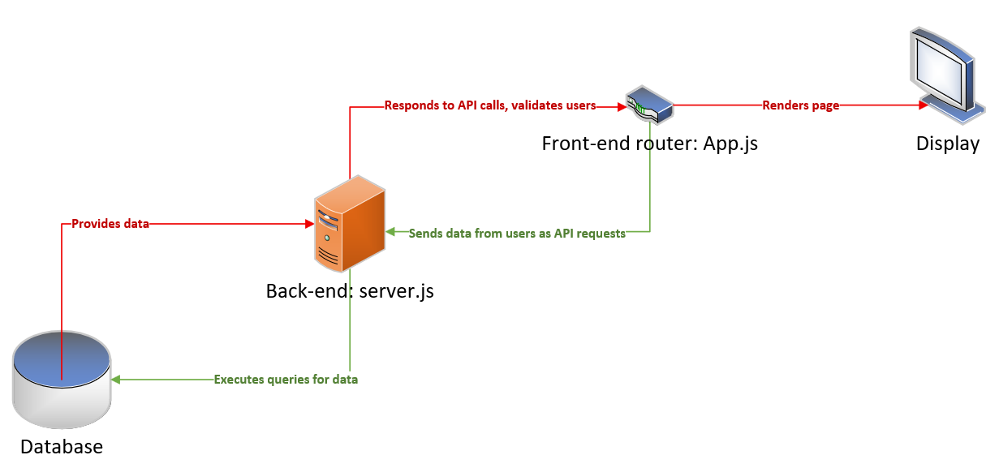
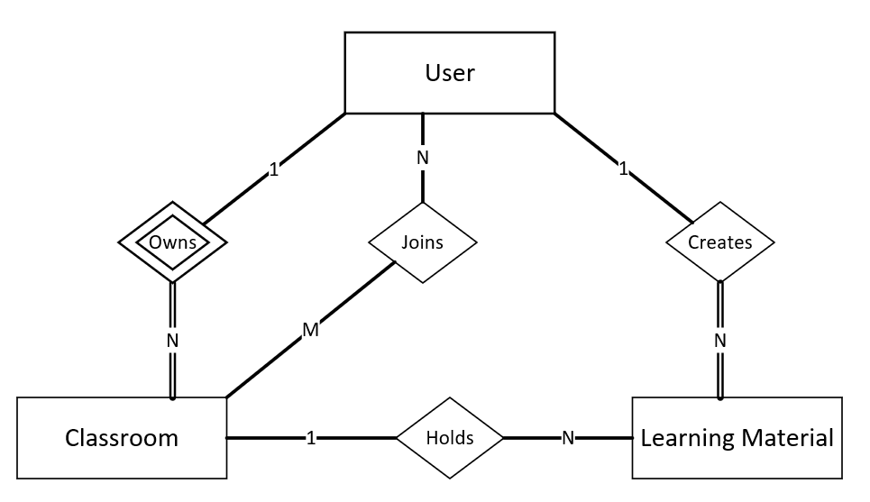
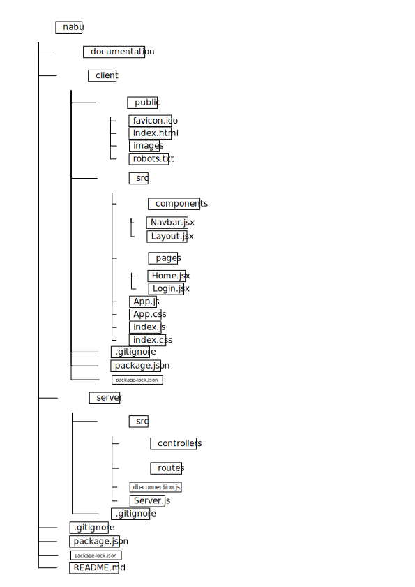

# Nabu
# Architecture Design
### Introduction
The purpose of this document is to give an overview of Nabu's architecture. It first explains the motivation behind the network structure, then shows that structure through a local-level network diagram. It then explains what technologies were used to develop this application, as well as recommended IDEs and extensions for readers looking to build similar projects. The document lists the npm packages necessary for the application's function, as well as those recommended for development. The architecture of Nabu is then discussed and represented visually through an Entity-Relation (ER) diagram and an iconographic diagram that shows the internal file structure of the project.

The goal of Nabu is to allow users to create and join classrooms in which they can create and use learning materials to stimulate gameified learning. As such, Nabu must be able to save some of its users' data, such as their credentials, classrooms, and learning materials. It must also allow interactions from multiple users. The optimal way to implement these desired features is through a website that can update and control its own internal database. 

### Network Diagram

Figure 1: The network diagram displays the general flow that the application goes through in order to render a page in the browser.

### Technologies and Purposes
The following table describes the technologies used in this application and their purposes.
<table>
	

		<tr>
			<th>Technology</th>
			<th>Purpose</th>
		</tr>
		<tr>
			<td>Visual Studio Code</td>
			<td>IDE used to develop the application and synchronize work through GitHub</td>
		</tr>
		<tr>
			<td>React</td>
			<td>JavaScript framework used to develop the front-end of the application.</td>
		</tr>
		<tr>
			<td>Node.js</td>
			<td>JavaScript runtime environment used to develop the back-end of the application.</td>
		</tr>
		<tr>
			<td>MySQL</td>
			<td>SQL database editor and serving environment used to build and host the database.</td>
		</tr>
	

</table>

#### Recommended IDEs and extensions
Visual Studio Code (VSCode) was used to develop this application. The following VSCode extensions are recommended for people aiming to develop a similar application:
<table>
	

		<tr>
			<th>Extension</th>
			<th>Author</th>
		</tr>
		<tr>
			<td>Auto Rename Tag</td>
			<td>Jun Huan</td>
		</tr>
		<tr>
			<td>CSS Peek</td>
			<td>Pranay Prakash</td>
		</tr>
		<tr>
			<td>ES7+ React/Redux/React-Native Snippets</td>
			<td>dsznajder</td>
		</tr>
		<tr>
			<td>JavaScript (ES6) code snippets</td>
			<td>charalampos karypidis</td>
		</tr>
		<tr>
			<td>open in browser</td>
			<td>TechER</td>
		</tr>
		<tr>
			<td>React Extension Pack</td>
			<td>Rajbir Jawanda</td>
		</tr>
		<tr>
			<td>React PropTypes Generate</td>
			<td>suming</td>
		</tr>
		<tr>
			<td>React Refactor</td>
			<td>AppWorks Team</td>
		</tr>
		<tr>
			<td>Search node_modules</td>
			<td>Jason Nutter</td>
		</tr>
	

</table>

#### List of NPM Packages
This list of npm packages is incomplete, but provides an overview of the packages needed for this project to function.
The following packages are necessary for the project to function:

	<tr>express</tr> 
	<tr>jsonwebtoken</tr> 
	<tr>body-parser</tr> 
	<tr>bcrypt</tr> 
	<tr>dotenv</tr> 
	<tr>path</tr> 
	<tr>bootstrap</tr> 
	<tr>react-router-dom</tr> 

 
The following packages came with React and are necessary for its function:

	<tr>react</tr> 
	<tr>react-dom</tr> 
	<tr>react-scripts</tr> 
	<tr>web-vitals</tr> 

 
The following packages are not necessary for the application, but were used in development:

	<tr>nodemon</tr>

##### Unified Syntax (dd-radic)

### Architecture
Nabu is a website built in React and hosted by Node.js. It is connected to a custom-built API server, which is connected to a database. This structure allows Nabu to take advantage of React's fast loading speed to quickly render its pages and make a smooth, responsive application. In addition, Node.js is one of the most popular hosting frameworks, allowing a lot of flexibility through the npm package library. The custom-built API server ensures security by allowing the developers to carefully curate what data is saved by the application and how that data is used to better protect its users. The database is also custom-built for a similar purpose. Nabu's overall design is such that it is easy to maintain and clearly partitions each function necessary for its operation in a logical manner.

### ER Diagram

Figure 2: The ER diagram shows only the entities and relations present in the database. Attributes have been omitted for readability.

#### File Structure

Figure 3: The diagram shows an overview of the structure of the GitHub project. Some paths (such as \nabu\server\routes) may be deprecated during development.